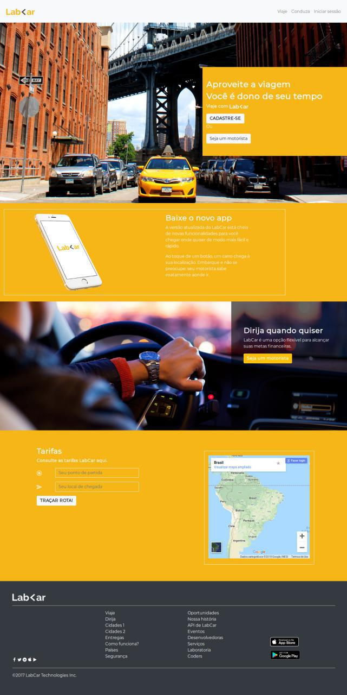
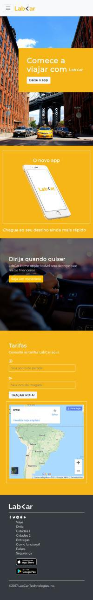

# labcar
Desafio de código do Sprint 3 da Laboratoria SP20181. Criar visual web responsivo com frameworks CSS, usando como base o design de LabCar.

* [Demo](https://maryfsc.github.io/labcar/)

## Recursos utilizados
* [Bootstrap](https://getbootstrap.com/)

## Web

## Mobile

